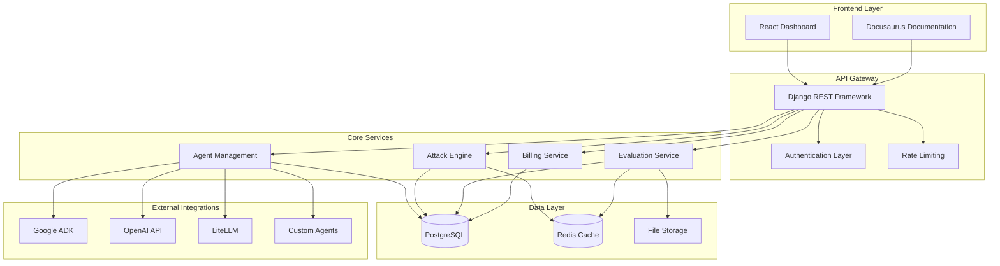
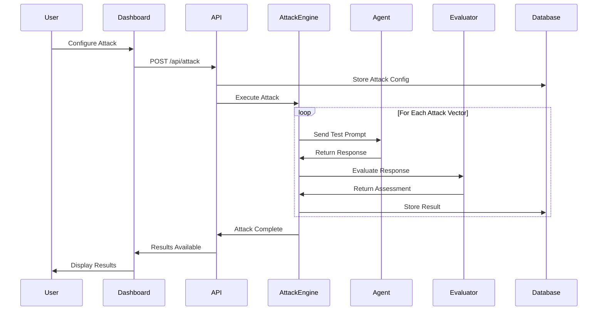
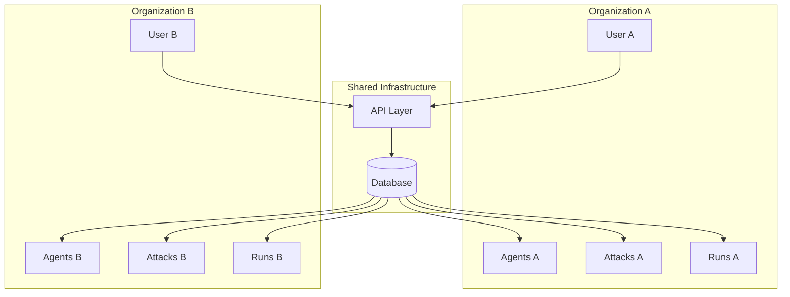
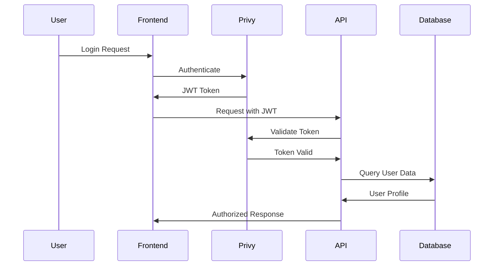
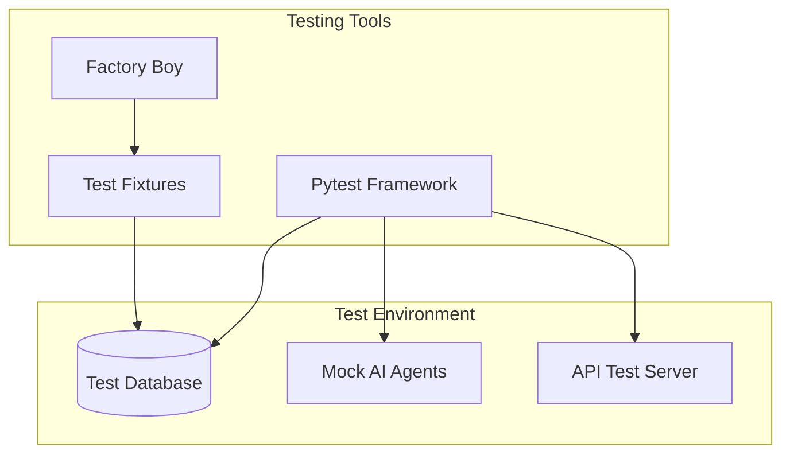

# System Architecture Overview

HackAgent is built as a comprehensive security testing platform with a modern, scalable architecture designed to handle enterprise-grade AI agent vulnerability assessments.

## 🏗️ High-Level Architecture



## 🧩 Core Components

### Frontend Layer

**React Dashboard (`/frontend/dashboard/`)**
- **Technology**: Next.js 15+ with React 19
- **UI Framework**: TailwindCSS + shadcn/ui components
- **Authentication**: Privy integration (Web3 + Social login)
- **State Management**: React hooks with local state
- **API Client**: Auto-generated TypeScript client from OpenAPI

**Docusaurus Documentation (`/frontend/docs/`)**
- **Purpose**: Comprehensive user and developer documentation
- **Features**: Search, versioning, mobile-responsive
- **Integration**: Served alongside the main application

### API Gateway

**Django REST Framework**
- **Routing**: RESTful endpoints with OpenAPI documentation
- **Serialization**: Automatic data validation and transformation
- **Pagination**: Consistent pagination across all endpoints
- **Filtering**: Django-filter integration for complex queries

**Authentication Layer**
- **Privy Authentication**: JWT-based auth with Web3/social login
- **API Key Authentication**: For programmatic access
- **Multi-tenant Support**: Organization-based access control
- **Permission System**: Role-based permissions

### Core Services

**Agent Management Service**
- **Purpose**: Manage AI agent configurations and connections
- **Features**: Multi-framework support, health checking, metadata management
- **Supported Types**: Google ADK, OpenAI SDK, LiteLLM, Custom REST APIs

**Attack Engine**
- **Attack Types**: Prompt injection, jailbreaking, goal hijacking
- **Techniques**: AdvPrefix, indirect injection, filter evasion
- **Execution**: Async attack orchestration with result aggregation
- **Extensibility**: Plugin system for custom attack vectors

**Evaluation Service**
- **Judge Models**: AI-powered result evaluation
- **Scoring**: Vulnerability severity assessment
- **Metrics**: Success rates, confidence scores, risk ratings
- **Reporting**: Detailed analysis and recommendations

**Billing Service**
- **Credit System**: Usage-based billing with real-time tracking
- **Payment Processing**: Stripe integration for subscriptions
- **Usage Logging**: Detailed API usage and cost tracking
- **Limits**: Rate limiting and quota management

### Data Layer

**PostgreSQL Database**
- **Multi-tenancy**: Organization-based data isolation
- **Models**: Agents, Attacks, Runs, Results, Traces, Users
- **Relationships**: Complex foreign key relationships with cascade handling
- **Performance**: Optimized queries with proper indexing

**Redis Cache (Future)**
- **Session Storage**: User session management
- **Attack Results**: Temporary result caching
- **Rate Limiting**: Token bucket implementation

## 🔄 Data Flow Architecture

### Attack Execution Flow



### Multi-Tenant Data Access



## 🔐 Security Architecture

### Authentication Flow



### Data Protection

- **Encryption at Rest**: Database encryption for sensitive data
- **Encryption in Transit**: TLS 1.3 for all API communications
- **Access Control**: Row-level security based on organization membership
- **Audit Logging**: Comprehensive audit trails for all actions
- **Data Isolation**: Strict tenant data separation

## 📈 Scalability Considerations

### Horizontal Scaling

- **Stateless API**: No server-side session storage
- **Database Optimization**: Read replicas for query scaling
- **Caching Strategy**: Redis for session and result caching
- **Load Balancing**: Multiple API server instances

### Performance Optimization

- **Async Processing**: Non-blocking attack execution
- **Result Streaming**: Real-time result updates via WebSockets
- **Database Indexing**: Optimized queries for large datasets
- **CDN Integration**: Static asset delivery optimization

## 🧪 Testing Architecture

### Test Isolation



### Test Categories

- **Unit Tests**: Individual component testing
- **Integration Tests**: API endpoint testing
- **End-to-End Tests**: Full user workflow testing
- **Security Tests**: Vulnerability scanning and penetration testing
- **Performance Tests**: Load testing and benchmarking

## 🚀 Deployment Architecture

### Container Strategy

```yaml
services:
  web:
    image: hackagent:latest
    ports: ["8000:8000"]
    environment:
      - DATABASE_URL
      - REDIS_URL
      - PRIVY_APP_ID
    
  db:
    image: postgres:15
    volumes:
      - postgres_data:/var/lib/postgresql/data
    
  redis:
    image: redis:7-alpine
    
  nginx:
    image: nginx:alpine
    ports: ["80:80", "443:443"]
    volumes:
      - ./nginx.conf:/etc/nginx/nginx.conf
```

### Production Considerations

- **Environment Separation**: Development, staging, production environments
- **Secret Management**: Environment-based secret injection
- **Health Checks**: Application and database health monitoring
- **Backup Strategy**: Automated database backups and restoration
- **Monitoring**: Application performance monitoring (APM)

This architecture provides a robust, scalable foundation for comprehensive AI agent security testing while maintaining security, performance, and maintainability standards. 