# Welcome to HackAgent

**HackAgent** is a red-team testing toolkit aimed at detecting and mitigating security vulnerabilities in AI systems.

Built for developers, red-teamers, and security engineers, **HackAgent** makes it easy to simulate adversarial inputs, automate prompt fuzzing, and validate the safety of your LLM-powered apps. 
Whether you're building a chatbot, autonomous agent, or internal LLM service, **HackAgent** helps you **test before attackers do**.

  <iframe
    src="https://www.loom.com/embed/1e4ce025ea4749fab169195e7b1222ba?sid=860a8fc6-4665-4497-b7a4-0580994da7ee"
    frameBorder="0"
    webkitAllowFullScreen
    mozAllowFullScreen
    allowFullScreen
    style={{
      position: 'absolute',
      top: '0',
      left: '0',
      width: '100%',
      height: '100%'
    }}
  ></iframe>

## 🎯 Why HackAgent?

### The AI Security Challenge

As AI agents become more sophisticated and integrated into critical systems, they present new attack surfaces that traditional security tools can't address:

- **Prompt Injection Attacks**: Malicious instructions embedded in user inputs
- **Jailbreaking Techniques**: Bypassing safety mechanisms and content filters  
- **Goal Hijacking**: Manipulating agent objectives and behavior
- **Tool Abuse**: Misusing agent capabilities for unauthorized actions
- **Data Exfiltration**: Extracting sensitive information through agent interactions

### Our Solution

**HackAgent** provides systematic, automated testing for these emerging threat vectors:

  
  
<em>See the complete testing workflow in action</em>

```mermaid
flowchart TD
    A["🎯 Define Targets<br/><small>Identify AI systems & vulnerabilities</small>"] --> B["⚔️ Execute Attacks<br/><small>Run AdvPrefix & injection tests</small>"]
    B --> C["🔍 Analyze Results<br/><small>Review attack success & patterns</small>"]
    C --> D["📊 Generate Reports<br/><small>Document findings & evidence</small>"]
    D --> E["🛡️ Implement Fixes<br/><small>Apply security mitigations</small>"]
    E --> F["🔄 Continuous Monitoring<br/><small>Schedule regular assessments</small>"]
    F --> A
    
    %% Node styling with security-themed colors
    style A fill:#ff6b6b,stroke:#c92a2a,stroke-width:3px,color:#fff
    style B fill:#ffa726,stroke:#ef6c00,stroke-width:3px,color:#fff
    style C fill:#42a5f5,stroke:#1976d2,stroke-width:3px,color:#fff
    style D fill:#66bb6a,stroke:#388e3c,stroke-width:3px,color:#fff
    style E fill:#ab47bc,stroke:#7b1fa2,stroke-width:3px,color:#fff
    style F fill:#26c6da,stroke:#0097a7,stroke-width:3px,color:#fff
    
    %% Add arrow styling
    linkStyle 0 stroke:#c92a2a,stroke-width:3px
    linkStyle 1 stroke:#ef6c00,stroke-width:3px
    linkStyle 2 stroke:#1976d2,stroke-width:3px
    linkStyle 3 stroke:#388e3c,stroke-width:3px
    linkStyle 4 stroke:#7b1fa2,stroke-width:3px
    linkStyle 5 stroke:#0097a7,stroke-width:3px
```

## 🔥 Core Capabilities

### 🔍 **Comprehensive Vulnerability Detection**

  

    <ul>
      <li><strong>AdvPrefix Attacks</strong>: Advanced prefix generation and optimization</li>
      <li><strong>Prompt Injection</strong>: Direct and indirect injection attacks</li>
      <li><strong>Jailbreaking</strong>: Advanced techniques to bypass safety measures</li>
      <li><strong>Tool Manipulation</strong>: Testing agent tool usage and permissions</li>
      <li><strong>Context Attacks</strong>: Manipulating conversation context and memory</li>
    </ul>
  

  

    
    
<em>Different attack types finding vulnerabilities</em>

  

### 🏢 **Enterprise-Grade Platform**

  

    
    
<em>Professional dashboard with real-time analytics</em>

  

  

    <ul>
      <li><strong>Multi-Tenant Architecture</strong>: Secure organization-based isolation</li>
      <li><strong>Professional Dashboard</strong>: Real-time monitoring and analytics</li>
      <li><strong>Credit-Based Billing</strong>: Pay-per-use with transparent pricing</li>
      <li><strong>API-First Design</strong>: Complete programmatic access</li>
      <li><strong>Audit Logging</strong>: Comprehensive security event tracking</li>
    </ul>
  

### 🧪 **Research-Backed Techniques**

- **AdvPrefix Implementation**: Sophisticated multi-step attack pipeline
- **Academic Integration**: Latest research from security conferences
- **Community Contributions**: Open-source attack vector library
- **Continuous Updates**: New techniques added regularly

### 🔌 **Universal Framework Support**

| Framework | Status | Use Cases |
|-----------|--------|-----------|
| **Google ADK** | ✅ Full Support | Tool-based agents, enterprise deployments |
| **LiteLLM** | ✅ Full Support | Multi-provider setups, cost optimization |
| **OpenAI SDK** | ✅ Full Support | ChatGPT-style agents, API integrations |

## 🏗️ Platform Architecture

### Full-Stack Security Platform

### Key Benefits

- **🔒 Security First**: Built with security best practices from the ground up
- **📈 Scalable**: Handles testing from individual researchers to enterprise teams
- **🔧 Extensible**: Plugin architecture for custom attack vectors
- **📚 Well-Documented**: Comprehensive guides for all skill levels
- **🤝 Community-Driven**: Open source with active community contributions

## 🎓 Getting Started

  
  
<em>From setup to first vulnerability in under 5 minutes</em>

Choose your path based on your role and needs:

**👨‍💻 Developers & Engineers**
- Start with the [Quick Start Guide](./HowTo.md) to get running in 5 minutes
- Follow the [Python SDK Guide](./sdk/python-quickstart.md) for programmatic testing
- Check [Google ADK Integration](./integrations/google-adk.md) for framework-specific setup

**🔐 Security Researchers**
- Learn [Attack Techniques](./tutorial-basics/AdvPrefix) and core attack vectors
- Explore [AdvPrefix Attacks](./attacks/advprefix-attacks.md) for advanced techniques
- Review [Responsible Use Guidelines](./security/responsible-disclosure.md)

**🏢 Organizations & Teams**
- Review our [Responsible Use](./security/responsible-disclosure.md) framework
- Understand the platform's security-first approach
- Contact us at [devs@vista-labs.ai](mailto:devs@vista-labs.ai) for enterprise support

## 🔐 Responsible Use

### ⚠️ Important Security Notice

HackAgent is designed for **authorized security testing only**. Always ensure you have explicit permission before testing any AI systems.

**Acceptable Use:**
- ✅ Testing your own AI agents and systems
- ✅ Authorized penetration testing engagements
- ✅ Security research with proper disclosure
- ✅ Educational and training purposes

**Prohibited Use:**
- ❌ Testing systems without permission
- ❌ Malicious exploitation of discovered vulnerabilities
- ❌ Harassment or abuse of AI systems
- ❌ Violating terms of service or laws

### 🛡️ Ethical Framework

We are committed to responsible AI security research:

1. **Coordinated Disclosure**: Work with vendors to fix vulnerabilities
2. **Harm Minimization**: Design tests to minimize potential damage
3. **Privacy Protection**: Respect user data and privacy
4. **Community Benefit**: Share knowledge to improve AI security

[Read our full Responsible Use Guidelines →](./security/responsible-disclosure.md)

## 🚀 Get Started Today

  <a 
    href="https://hackagent.dev" 
    style={{
      padding: '1rem 2rem',
      backgroundColor: '#1976d2',
      color: 'white',
      textDecoration: 'none',
      borderRadius: '8px',
      fontWeight: 'bold',
      textAlign: 'center',
      minWidth: '200px'
    }}
  >
    🚀 Try the Platform
  </a>
  
  <a 
    href="./HowTo" 
    style={{
      padding: '1rem 2rem',
      backgroundColor: '#388e3c',
      color: 'white',
      textDecoration: 'none',
      borderRadius: '8px',
      fontWeight: 'bold',
      textAlign: 'center',
      minWidth: '200px'
    }}
  >
    📚 Read the Guide
  </a>
  
  <a 
    href="https://github.com/vistalabs-org/hackagent" 
    style={{
      padding: '1rem 2rem',
      backgroundColor: '#424242',
      color: 'white',
      textDecoration: 'none',
      borderRadius: '8px',
      fontWeight: 'bold',
      textAlign: 'center',
      minWidth: '200px'
    }}
  >
    ⭐ Star on GitHub
  </a>

---

**Ready to secure your AI agents?** Start with our [5-minute quick start guide](./HowTo.md) or dive deep into our [Python SDK documentation](./sdk/python-quickstart.md).

**Have questions?** Join our [community discussions](https://github.com/vistalabs-org/hackagent/discussions) or reach out to our team at [devs@vista-labs.ai](mailto:devs@vista-labs.ai).

**Building something cool?** We'd love to hear about it! Share your use cases and contribute to making AI systems more secure for everyone.

