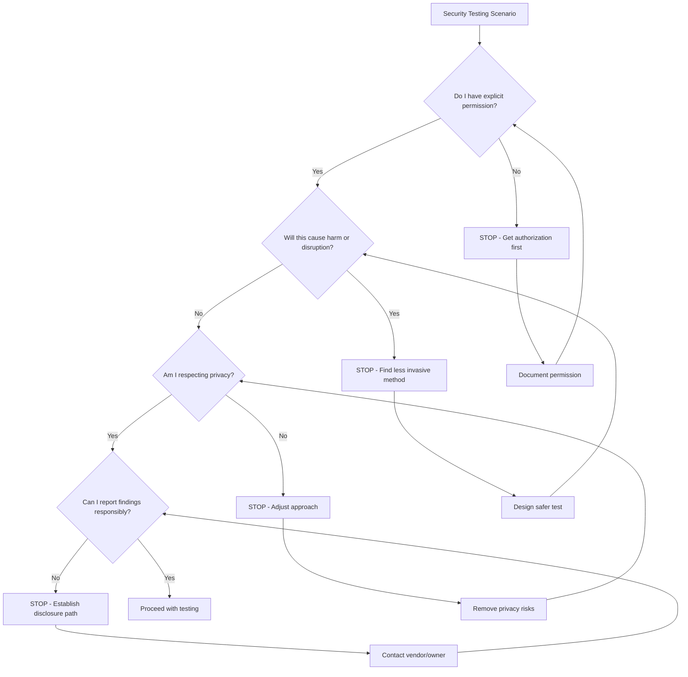

# Ethical Guidelines & Security Best Practices

This document outlines the ethical framework and security best practices for using HackAgent responsibly in AI security research and testing.

## 🎯 Ethical Framework

### The HackAgent Ethics Code

As a HackAgent user, you commit to:

1. **🛡️ Do No Harm**: Never use HackAgent to cause damage, disruption, or unauthorized access
2. **📋 Get Permission**: Always obtain explicit authorization before testing
3. **🤝 Act in Good Faith**: Use discoveries to improve security, not to exploit or profit maliciously
4. **🔒 Protect Privacy**: Respect user data and privacy at all times
5. **📢 Disclose Responsibly**: Report vulnerabilities through proper channels
6. **📚 Share Knowledge**: Contribute to the collective security knowledge base

### Ethical Decision Framework

When facing ethical dilemmas during security testing, ask yourself:



## 🔐 Security Best Practices

### Environment Security

**Secure Testing Environment:**
```bash
# Use isolated testing environment
docker run --network isolated hackagent-test

# Separate test credentials
export HACKAGENT_TEST_API_KEY="test_key_only"

# Monitor resource usage
docker stats hackagent-test
```

**Data Handling:**
- Use synthetic test data whenever possible
- Encrypt sensitive configuration files
- Implement secure credential storage
- Regular security audits of testing environment

### API Security

**Authentication Best Practices:**
```python
import os
from hackagent import HackAgent

# Use environment variables for credentials
api_key = os.getenv('HACKAGENT_API_KEY')
if not api_key:
    raise ValueError("API key not found in environment")

# Configure secure headers
agent = HackAgent(
    api_key=api_key,
    timeout=30,  # Reasonable timeout
    max_retries=3,  # Limit retry attempts
    verify_ssl=True  # Always verify SSL certificates
)
```

**Rate Limiting Compliance:**
```python
import time
import asyncio
from hackagent import HackAgent

class ResponsibleTester:
    def __init__(self, agent: HackAgent, rate_limit_delay=1.0):
        self.agent = agent
        self.rate_limit_delay = rate_limit_delay
        self.last_request_time = 0
    
    async def test_with_rate_limit(self, attack_config):
        # Respect rate limits
        time_since_last = time.time() - self.last_request_time
        if time_since_last < self.rate_limit_delay:
            await asyncio.sleep(self.rate_limit_delay - time_since_last)
        
        result = await self.agent.hack(attack_config)
        self.last_request_time = time.time()
        return result
```

### Testing Boundaries

**Scope Definition:**
```python
class TestingScope:
    def __init__(self):
        self.authorized_endpoints = []
        self.forbidden_endpoints = []
        self.max_test_duration = 3600  # 1 hour
        self.max_requests_per_hour = 100
        
    def is_authorized(self, endpoint: str) -> bool:
        """Check if endpoint is authorized for testing"""
        if endpoint in self.forbidden_endpoints:
            return False
        return endpoint in self.authorized_endpoints
    
    def within_limits(self, requests_made: int, duration: int) -> bool:
        """Check if testing is within defined limits"""
        if duration > self.max_test_duration:
            return False
        if requests_made > self.max_requests_per_hour:
            return False
        return True
```

## 🧪 Research Ethics

### Academic Research Guidelines

**Institutional Review Board (IRB) Considerations:**

For research involving AI systems that may process human data:

```markdown
## HackAgent Research Protocol Template

### Research Objective
- Primary research question
- Hypothesis being tested
- Expected contributions to AI security

### Methodology
- Target AI systems (with permission documentation)
- Attack vectors to be tested
- Data collection procedures
- Analysis methodology

### Ethical Considerations
- Potential risks to systems and users
- Mitigation strategies
- Data handling procedures
- Disclosure timeline

### Human Subjects Protection
- Does research involve human subjects? (Even indirectly)
- Data privacy protections
- Informed consent procedures (if applicable)
- De-identification strategies
```

**Publication Ethics:**
```python
class PublicationGuidelines:
    """Guidelines for publishing AI security research"""
    
    @staticmethod
    def should_publish_attack_details(attack_severity: str, 
                                    vendor_cooperation: bool,
                                    fix_available: bool) -> dict:
        """Determine appropriate level of detail for publication"""
        
        if attack_severity == "critical" and not fix_available:
            return {
                "publish_concept": True,
                "publish_details": False,
                "publish_code": False,
                "coordinate_with_vendor": True
            }
        
        if fix_available and vendor_cooperation:
            return {
                "publish_concept": True,
                "publish_details": True,
                "publish_code": True,  # With defensive focus
                "acknowledge_vendor": True
            }
        
        return {
            "publish_concept": True,
            "publish_details": False,
            "publish_code": False,
            "seek_ethics_review": True
        }
```

### Industry Research Standards

**Professional Consulting:**
```python
class ConsultingEthics:
    """Ethical guidelines for commercial security consulting"""
    
    def __init__(self):
        self.client_agreement_required = True
        self.scope_document_required = True
        self.liability_coverage_required = True
    
    def pre_engagement_checklist(self) -> list:
        return [
            "Written statement of work signed",
            "Testing scope clearly defined",
            "Emergency contact procedures established",
            "Data handling agreements in place",
            "Insurance coverage verified",
            "Legal compliance reviewed"
        ]
    
    def during_engagement_practices(self) -> list:
        return [
            "Regular client communication",
            "Immediate reporting of critical findings",
            "Detailed documentation of all activities",
            "Respect for confidentiality",
            "Professional conduct maintenance"
        ]
```

## 🌍 Global Considerations

### Cross-Border Legal Compliance

**Multi-Jurisdictional Testing:**
```python
import pycountry
from typing import List, Dict

class LegalComplianceChecker:
    def __init__(self):
        self.legal_frameworks = {
            'US': ['CFAA', 'State Laws', 'DMCA'],
            'EU': ['GDPR', 'NIS Directive', 'Computer Misuse Acts'],
            'UK': ['Computer Misuse Act 1990', 'GDPR (UK)', 'Data Protection Act'],
            'CA': ['Personal Information Protection Act', 'Criminal Code'],
            'AU': ['Privacy Act 1988', 'Cybercrime Act 2001']
        }
    
    def check_compliance(self, target_country: str, 
                        testing_type: str) -> Dict[str, any]:
        """Check legal compliance for testing in specific country"""
        
        if target_country not in self.legal_frameworks:
            return {
                "status": "unknown",
                "recommendation": "Consult local legal counsel",
                "risk_level": "high"
            }
        
        frameworks = self.legal_frameworks[target_country]
        return {
            "applicable_laws": frameworks,
            "recommendation": "Review specific requirements",
            "required_documentation": [
                "Written authorization",
                "Data protection compliance",
                "Incident response plan"
            ]
        }
```

### Cultural Sensitivity

**Global Research Considerations:**
- Respect local privacy expectations
- Understand cultural attitudes toward security research
- Consider language barriers in communication
- Respect different business practices and timelines
- Be aware of geopolitical sensitivities

## 📊 Impact Assessment

### Vulnerability Severity Scoring

```python
from enum import Enum
from dataclasses import dataclass

class SeverityLevel(Enum):
    LOW = "low"
    MEDIUM = "medium"
    HIGH = "high"
    CRITICAL = "critical"

@dataclass
class VulnerabilityAssessment:
    attack_type: str
    ease_of_exploitation: int  # 1-10 scale
    potential_impact: int      # 1-10 scale
    affected_users: int
    data_sensitivity: str
    
    def calculate_severity(self) -> SeverityLevel:
        """Calculate overall vulnerability severity"""
        score = (self.ease_of_exploitation + self.potential_impact) / 2
        
        if score >= 9 or self.data_sensitivity == "critical":
            return SeverityLevel.CRITICAL
        elif score >= 7:
            return SeverityLevel.HIGH
        elif score >= 5:
            return SeverityLevel.MEDIUM
        else:
            return SeverityLevel.LOW
    
    def get_disclosure_timeline(self) -> int:
        """Get recommended disclosure timeline in days"""
        severity_timelines = {
            SeverityLevel.CRITICAL: 30,
            SeverityLevel.HIGH: 60,
            SeverityLevel.MEDIUM: 90,
            SeverityLevel.LOW: 120
        }
        return severity_timelines[self.calculate_severity()]
```

### Risk Communication

**Stakeholder Communication Framework:**
```python
class StakeholderCommunication:
    def __init__(self, vulnerability: VulnerabilityAssessment):
        self.vulnerability = vulnerability
    
    def technical_report(self) -> dict:
        """Generate technical report for security teams"""
        return {
            "executive_summary": self._executive_summary(),
            "technical_details": self._technical_details(),
            "reproduction_steps": self._reproduction_steps(),
            "remediation_recommendations": self._remediation_recommendations(),
            "timeline": self._suggested_timeline()
        }
    
    def business_impact_summary(self) -> dict:
        """Generate business-focused impact summary"""
        return {
            "business_risk": self._business_risk_assessment(),
            "user_impact": self._user_impact_summary(),
            "compliance_implications": self._compliance_implications(),
            "recommended_actions": self._business_actions(),
            "resource_requirements": self._resource_estimation()
        }
```

## 🤝 Community Standards

### Open Source Contribution Ethics

**Contributing to HackAgent:**
```python
class ContributionGuidelines:
    """Guidelines for contributing to HackAgent project"""
    
    @staticmethod
    def acceptable_contributions() -> list:
        return [
            "New defensive techniques",
            "Improved detection methods",
            "Better evaluation metrics",
            "Documentation improvements",
            "Bug fixes and performance improvements",
            "Educational content"
        ]
    
    @staticmethod
    def unacceptable_contributions() -> list:
        return [
            "Pure offensive techniques without defensive value",
            "Exploits targeting specific organizations",
            "Techniques designed to cause harm",
            "Copyrighted or proprietary code",
            "Techniques violating platform terms of service"
        ]
```

### Peer Review Standards

**Research Peer Review:**
```markdown
## HackAgent Research Review Checklist

### Technical Quality
- [ ] Methodology is sound and reproducible
- [ ] Results are statistically significant
- [ ] Limitations are clearly acknowledged
- [ ] Related work is properly cited

### Ethical Standards
- [ ] Proper authorization was obtained
- [ ] Privacy protections were implemented
- [ ] Harm minimization was considered
- [ ] Responsible disclosure was followed

### Defensive Focus
- [ ] Research contributes to defensive knowledge
- [ ] Mitigation strategies are provided
- [ ] Educational value is clear
- [ ] Offensive details are appropriately limited
```

## 📞 Getting Help

### Ethics Consultation

**When to Seek Guidance:**
- Unclear authorization boundaries
- Potential legal implications
- Cross-border testing considerations
- Novel attack discovery
- Uncertain disclosure timelines

**Resources for Ethical Guidance:**
- **HackAgent Community**: [GitHub Discussions](https://github.com/vistalabs-org/hackagent/discussions)
- **Professional Organizations**: ISACA, (ISC)², SANS
- **Academic Resources**: University IRBs, research ethics committees
- **Legal Counsel**: Cybersecurity law specialists

### Emergency Ethics Support

For urgent ethical dilemmas during security testing:

**Emergency Contact Process:**
1. **Stop current testing** immediately
2. **Document the situation** without compromising security
3. **Contact appropriate authorities**:
   - Internal: Your organization's security team
   - External: Affected organization's security contact
   - Professional: Ethics committee or legal counsel
4. **Await guidance** before proceeding

---

**Remember**: Ethical security research is not just about following rules—it's about building a more secure and trustworthy digital world for everyone. Your commitment to these principles makes you a valuable member of the security research community.

For ethics questions specific to HackAgent, reach out to our community at [devs@vista-labs.ai](mailto:devs@vista-labs.ai). 